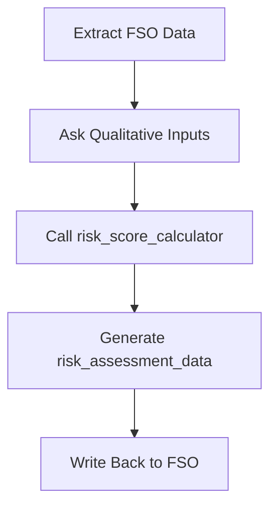

# Risk Score Calculator — README

## Overview

The **Risk Score Calculator** is the core computational engine used by the  
`risk_assessment_agent` to transform subjective and objective financial inputs  
into a structured risk score and investment risk profile.

This calculator is designed for integration into an ADK-based multi-agent  
financial planning workflow and produces output that can be directly merged  
into the Financial State Object (FSO).

---

## 🔍 Purpose

The tool evaluates **three major dimensions of risk**:

1. **Risk Capacity**  
   Based on:

   - Time horizon
   - Emergency fund depth
   - Income stability

2. **Risk Tolerance**  
   Based on behavioral response to a 20% portfolio decline.

3. **Risk Exposure & Gaps**  
   Determines the presence of:
   - Insurance needs
   - Liquidity risk
   - Dependents-based protection gaps

The output includes both a numerical score and advisory insights.

---

## 📥 Inputs

| Parameter                 | Type      | Description                                 |
| ------------------------- | --------- | ------------------------------------------- |
| `time_horizon_years`      | int       | Longest investment goal duration            |
| `emergency_fund_months`   | int       | Number of months covered by emergency funds |
| `income_stability_rating` | int (1–5) | Subjective stability score                  |
| `volatility_choice`       | str       | A/B/C or textual reactions to volatility    |
| `has_dependents`          | bool      | Whether dependents are present              |
| `debt_exceeds_assets`     | bool      | Liquidity risk indicator                    |

---

## 📤 Output Structure

The function returns the following dictionary:

```json
{
  "raw_risk_score": 55,
  "risk_profile": "Moderate",
  "investment_time_horizon": "Long-term (Aggressive Capacity)",
  "insurance_gaps": "Potential Need for Life and Disability Insurance.",
  "liquidity_risk": "Balanced."
}
```

---

## 🧮 Scoring Methodology

### 1. Capacity for Risk (0–40 points)

- **Time Horizon (max 20)**
- **Emergency Fund (max 10)**
- **Income Stability (max 10)**

### 2. Tolerance for Risk (0–30 points)

- **Volatility reaction** interpreted as:
  - C = Aggressive (+30)
  - B = Moderate (+15)
  - A = Conservative (+0)

### 3. Exposure Indicators (qualitative)

- Insurance gap detection
- Liquidity stress

---

## 🧩 Integration With Risk Assessment Agent

This tool is called by:

```
risk_assessment_agent.py
```

Flow:



---

## 📌 Example Usage

```python
result = risk_score_calculator(
    time_horizon_years=10,
    emergency_fund_months=4,
    income_stability_rating=4,
    volatility_choice="B",
    has_dependents=True,
    debt_exceeds_assets=False
)
```

---

## 📘 Notes & Best Practices

- This tool should not handle validation—agents must pre-validate inputs.
- Always store the final output under the **`risk_assessment_data`** key in the FSO.
- A real system may expand the scoring for finer granularity.

---
